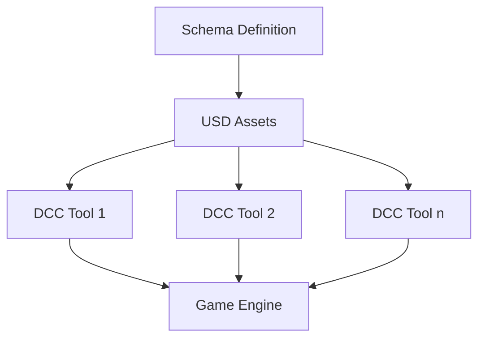
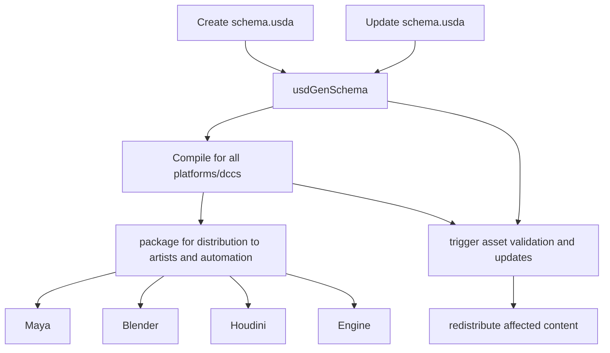
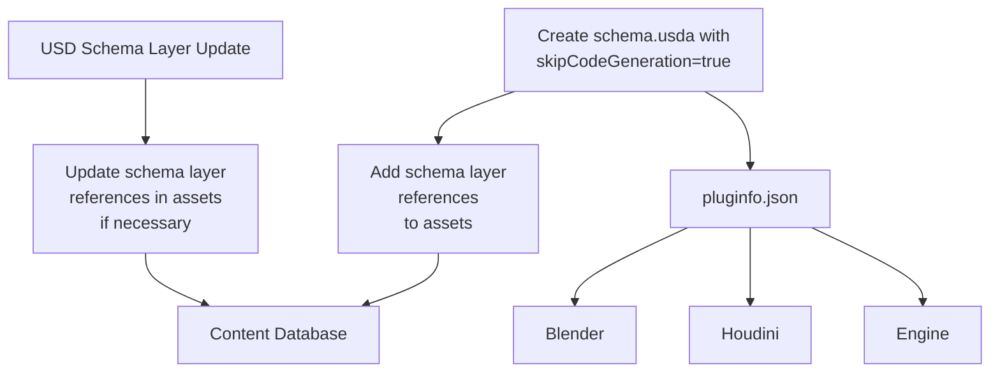

# Codeless Schemas

Game data evolves rapidly during production, as do the requirements of description of data. Whenever some fundamental record is changed, introduced, or removed, care must be taken across the production workflow to ensure that the new structures are integrated well and existing data is migrated properly.

Universal Scene Description (USD) offers solutions to these challenges by providing:

1. A standard way to define schemas
2. Strong composition capabilities
3. A growing ecosystem of integrations
4. High-performance data access patterns

USD schemas fall into three main categories, each serving a different purpose in the USD ecosystem, and each with unique advantages for gamedev workflows:

1. **Typed IsA Schemas**
2. **API Schemas**
3. **Codeless Schemas**

### Typed IsA Schemas

IsA schemas define prim types within the USD type system. They are what most people initially think of when discussing "USD schemas." These schemas come in two flavors:

#### Concrete IsA Schemas

- **Definition**: Instantiable schemas that define specific types of prims
- **Examples**: `UsdGeomMesh`, `UsdLuxDiskLight`, `UsdShadeMaterial`
- **Usage**: `def Mesh "Character" {}`

Entities defined with concrete IsA schemes usually represent foundational game assets such as characters, props, environments, lights, effects, and so on.

#### Abstract IsA Schemas

- **Definition**: Cannot be instantiated directly, provide base classes for other schemas and define common properties
- **Examples**: `UsdGeomImageable`, `UsdShadeConnectableAPI`

IsA schemas establish an inheritance hierarchy and typically require C++ code generation to provide an API for interacting with the schemas.

### API Schemas

API schemas enhance existing prims with additional properties without changing their underlying type, and can also provide functional interfaces for utility purposes. 

API Schemas come in three varieties:

#### Non-Applied API Schemas

- **Definition**: Provide interface to metadata or non-authoring API
- **Examples**: `UsdModelAPI`, `UsdClipsAPI`

These can be used to manage game-specific metadata, without altering asset types

#### Single-Applied API Schemas

- **Definition**: Add a fixed set of properties to a prim when applied
- **Examples**: `UsdGeomModelAPI`, `UsdGeomMotionAPI`

These can be used to add gameplay attributes to assets, such as health, inventories, etc.

#### Multiple-Applied API Schemas

- **Definition**: Can be applied multiple times with different instance names
- **Examples**: `UsdCollectionAPI`

These can be used when more than one instance of a particular schema can be applied to a single prim; for example, an entity may have multiple damage zones, a multi-slot inventory system, and so on.

API schemas are applied using the `apiSchemas` metadata field on a prim, in a manner reminiscent of components in a game engine's Entity Component system.

```usda
def Xform "Player" (
    apiSchemas = ["GameplayStatsAPI", "InventoryAPI", "EquipmentAPI"]
)
{
    # Prim contents here
}
```

However, certain practical aspects of USD development and integration pose challenges in an environment where fundamental data schemas evolve rapidly:

1. **Compilation Requirements**: Changing a schemas requires compilation of C++ plugins for each DCC tool and engine.
2. **Build Matrix Explosion**: Each (DCC tool, platform, engine version) combination requires separate plugin builds.
3. **Deployment Complexities**: Distributing compiled plugins across a studio is challenging, especially with regular schema updates.
4. **Data Migration**: A schema change must also be accompanied by migration of existing data.

### Codeless Schemas

Codeless schemas, introduced in USD 21.08, allow schema definitions to be populated into the schema registry without requiring compilation and linking of generated C++ code. This means schemas can travel with the assets themselves, rather than requiring precompiled plugin updates at each stage of the pipeline:



- **Definition**: Schema definitions that populate into the USD schema registry without requiring compilation of C++ code
- **Characteristic**: Maintain the same semantic meaning as traditional schemas, but with different deployment mechanics
- **Query Mechanism**: Standard `UsdPrim` and `UsdAttribute` methods (no specialized C++ API)
- **Game Context**: Perfect for rapidly evolving game schemas that need to be distributed across studios
  
"We publish codeless schemas for just about every concept in RenderMan, making use of autoApply schemas heavily to (e.g.) extend UsdLux light types and UsdRender types when you're in a RenderMan/hdPrman environment."

"We use codeless schemas for defining new prim types for things like procedurals and simulations. We have a node in Nuke that will generate a UI from a schema so this gives an easy way to extend the system for us."

Game studios can apply the same pattern to gameplay concepts:

- Define game-specific entity types (enemies, pickups, spawners) as codeless schemas
- Define gameplay attributes (health, damage, team affiliations) as codeless API schemas
- Apply these schemas to standard geometric assets

### Code Access Patterns

A key difference between compiled and codeless schemas is in how their data is accessed from code:

#### Compiled Schema Access

```cpp
// C++ with compiled schemas
UsdPrim prim = stage->GetPrimAtPath("/Game/Player");
GameStatsAPI stats(prim);
if (stats) {
    float health = stats.GetHealthAttr().Get();
    GfVec3f position = stats.GetSpawnPointAttr().Get();
}
```

#### Codeless Schema Access

```cpp
// C++ with codeless schemas
UsdPrim prim = stage->GetPrimAtPath("/Game/Player");
if (prim.HasAPI<TfType::Find<class GameStatsAPI>>()) {
    UsdAttribute healthAttr = prim.GetAttribute("gameplay:stats:health");
    float health;
    healthAttr.Get(&health);
    
    UsdAttribute spawnPointAttr = prim.GetAttribute("gameplay:stats:spawnPoint");
    GfVec3f position;
    spawnPointAttr.Get(&position);
}
```

While codeless schemas require slightly more verbose access code, they provide flexibility in deployment and iteration.

## Codeless Schemas in Game Development

### Deployment Flexibility

Traditional IsA and API schemas require compiled C++ plugins to be deployed to every DCC tool and build target. For a studio with multiple tools and platforms, this creates an exponential deployment matrix.

Codeless schemas, by contrast, can travel with the USD assets themselves:

#### Plugin based Schema Deployment:


#### Codeless Schema Deployment:



### Developer Workflow Integration

Codeless schemas fit naturally into modern game development workflows:

- Can be version-controlled alongside game asset data
- Can be updated without recompiling tools
- Can be distributed to artists via standard content distribution mechanisms
- Can evolve during production without greatly reduced engineering overhead

1. **Deployment as assets**: Codeless schemas with composition are distributed like any other asset update, not as compiled plugins. This means level designers can create new enemy variants, equipment types, or game mechanics without requiring an engine rebuild.

2. **Standard property access**: At runtime, the engine accesses these composed properties using standard USD property access methods rather than through generated C++ API classes:

```cpp
// Access to a composed property in a codeless schema
UsdPrim enemyPrim = stage->GetPrimAtPath("/Level/Enemies/Carrot_01");
UsdAttribute healthAttr = enemyPrim.GetAttribute("sparkle:health:current");
float health;
healthAttr.Get(&health);
```

3. **Pipeline integration**: Changes to composition structure (adding variants, changing inheritance, etc.) can flow through the content pipeline rather than requiring code changes and recompilation.

4. **Iteration speed**: This approach dramatically speeds up iteration, as game designers can experiment with different composition strategies without waiting for engineering support.

# The Power of Templated Game Entities

Game worlds are built from repeating elements: enemies, items, props, buildings, and more. Creating and maintaining these entities efficiently is crucial for scalable game development. USD's composition system provides powerful mechanisms for implementing template-based workflows that will feel familiar to game developers accustomed to prefab systems, but with additional flexibility and capabilities.

Codeless schemas are key tool for implementing templated game entities, and dynamically evolving them through production as game development progresses.

## Entity Templates vs. Traditional Prefabs

Traditional game engine prefabs typically offer a simple parent-child relationship between a template and its instances. USD's composition system provides a richer set of tools:

| Feature | Traditional Prefabs | USD Composition |
|---------|---------------------|-----------------|
| Template changes propagate to instances | ✓ | ✓ |
| Instance-specific overrides | ✓ | ✓ |
| Deep nesting of templates | Sometimes | ✓ |
| Multiple inheritance from templates | Rarely | ✓ |
| Layered override system | Limited | ✓ |
| Variant configurations | Limited | ✓ |
| Template versioning | Rarely | ✓ |
| Late-binding of references | Rarely | ✓ |

This expanded toolkit enables more flexible and powerful entity authoring workflows.

## Creating Entity Template Libraries

A well-organized template library forms the foundation of efficient entity creation. Let's explore how to structure such a library using USD composition.

### Base Template Structure

```usda
#usda 1.0
(
    defaultPrim = "Templates"
)

def "Templates" (
    kind = "group"
)
{
    def "Characters" (
        kind = "group"
    )
    {
        def "BaseCharacter" (
            kind = "component"
        )
        {
            # Common character properties
            float sparkle:health:maximum = 100
            float sparkle:health:current = 100
            float sparkle:movement:speed = 5
            
            # Common character structure
            def Xform "Appearance" {}
            def Xform "Equipment" {}
            def Xform "Animation" {}
            def Xform "Audio" {}
            def Xform "Effects" {}
            def Xform "Behavior" {}
            def Xform "Physics" {}
        }
        
        def "BaseEnemy" (
            inherits = </Templates/Characters/BaseCharacter>
            kind = "component"
        )
        {
            # Enemy-specific defaults
            token sparkle:entity:category = "enemy"
            token sparkle:ai:behavior = "aggressive"
        }
        
        def "BaseNPC" (
            inherits = </Templates/Characters/BaseCharacter>
            kind = "component"
        )
        {
            # NPC-specific defaults
            token sparkle:entity:category = "npc"
            token sparkle:ai:behavior = "neutral"
        }
    }
    
    def "Items" (
        kind = "group"
    )
    {
        def "BaseItem" (
            kind = "component"
        )
        {
            # Common item properties
            token sparkle:entity:category = "item"
            token sparkle:interaction:type = "pickup"
            
            # Common item structure
            def Xform "Appearance" {}
            def Xform "Effects" {}
            def Xform "Physics" {}
        }
        
        def "BaseWeapon" (
            inherits = </Templates/Items/BaseItem>
            kind = "component"
        )
        {
            # Weapon-specific defaults
            token sparkle:item:type = "weapon"
            float sparkle:weapon:damage = 10
            float sparkle:weapon:range = 2
        }
        
        def "BaseConsumable" (
            inherits = </Templates/Items/BaseItem>
            kind = "component"
        )
        {
            # Consumable-specific defaults
            token sparkle:item:type = "consumable"
            token sparkle:consumable:effect = "none"
            float sparkle:consumable:amount = 0
        }
    }
    
    def "Environment" (
        kind = "group"
    )
    {
        def "BaseProp" (
            kind = "component"
        )
        {
            # Common prop properties
            token sparkle:entity:category = "prop"
            bool sparkle:physics:isStatic = true
            
            # Common prop structure
            def Xform "Appearance" {}
            def Xform "Physics" {}
        }
        
        def "BaseBuilding" (
            kind = "component"
        )
        {
            # Common building properties
            token sparkle:entity:category = "building"
            bool sparkle:physics:isStatic = true
            
            # Common building structure
            def Xform "Exterior" {}
            def Xform "Interior" {}
            def Xform "Physics" {}
        }
    }
}
```

This foundational structure provides base templates organized by category, establishing consistent default properties and structure.

### Specific Entity Templates

Building on this foundation, we can create more specific entity templates:

```usda
#usda 1.0
(
    defaultPrim = "Templates"
    subLayers = [
        @base_templates.usda@
    ]
)

over "Templates" {
    over "Characters" {
        def "Carrot" (
            inherits = </Templates/Characters/BaseEnemy>
            kind = "component"
        )
        {
            # Carrot enemy template
            token sparkle:entity:type = "carrot"
            float sparkle:health:maximum = 75
            float sparkle:combat:damage = 15
            float sparkle:movement:speed = 3
            
            over "Appearance" {
                def Xform "Geometry" {
                    def Mesh "Body" (
                        references = @assets/characters/carrot_body.usda@</Mesh>
                    )
                    {
                    }
                    
                    def Mesh "Leaves" (
                        references = @assets/characters/carrot_leaves.usda@</Mesh>
                    )
                    {
                    }
                }
                
                def Xform "Materials" {
                    def Material "CarrotMaterial" (
                        references = @assets/materials/carrot_material.usda@</Material>
                    )
                    {
                    }
                    
                    def Material "LeavesMaterial" (
                        references = @assets/materials/leaves_material.usda@</Material>
                    )
                    {
                    }
                }
            }
            
            over "Animation" {
                def Skeleton "CarrotSkeleton" (
                    references = @assets/skeletons/carrot_skeleton.usda@</Skeleton>
                )
                {
                }
                def SkelAnimation "CarrotIdleAnim" (
                    references = @assets/animations/carrot_idle.usda@</Animation>
                )
                {
                }
                def SkelAnimation "CarrotWalkAnim" (
                    references = @assets/animations/carrot_walk.usda@</Animation>
                )
                {
                }
                def SkelAnimation "CarrotAttackAnim" (
                    references = @assets/animations/carrot_attack.usda@</Animation>
                )
                {
                }
            }
            
            over "Behavior" {
                def "CarrotBehavior" {
                    token sparkle:ai:attackType = "melee"
                    token sparkle:ai:movementType = "ground"
                    float sparkle:ai:aggroRadius = 8
                    float sparkle:ai:attackRadius = 2
                }
            }
            
            # Variant set for different carrot types
            variantSet "carrotType" = {
                "basic" {
                    # Default values from above
                }
                
                "elite" {
                    over "Appearance" {
                        over "Materials" {
                            over "CarrotMaterial" (
                                references = @assets/materials/elite_carrot_material.usda@</Material>
                            )
                            {
                            }
                        }
                    }
                    float sparkle:health:maximum = 150
                    float sparkle:combat:damage = 25
                }
                
                "giant" {
                    over "Appearance" {
                        over "Geometry" {
                            # Scaling transformation
                            matrix4d xformOp:transform = ( (2, 0, 0, 0), (0, 2, 0, 0), (0, 0, 2, 0), (0, 0, 0, 1) )
                            uniform token[] xformOpOrder = ["xformOp:transform"]
                        }
                    }
                    float sparkle:health:maximum = 300
                    float sparkle:combat:damage = 40
                    float sparkle:movement:speed = 2
                }
            }
        }
        
        def "Farmer" (
            inherits = </Templates/Characters/BaseNPC>
            kind = "component"
        )
        {
            # Farmer NPC template
            token sparkle:entity:type = "farmer"
            
            over "Appearance" {
                def Mesh "FarmerMesh" (
                    references = @assets/characters/farmer.usda@</Mesh>
                )
                {
                }
            }
            
            over "Behavior" {
                def "FarmerBehavior" {
                    token sparkle:ai:behavior = "neutral"
                    rel sparkle:ai:dialogTree = </DialogTrees/Farmer>
                    string[] sparkle:ai:schedule:activities = [
                        "sleep", "work_field", "rest", "work_field", "socialize", "sleep"
                    ]
                    float[] sparkle:ai:schedule:times = [
                        0.0, 6.0, 12.0, 13.0, 18.0, 22.0
                    ]
                }
            }
            
            # Variant set for different farmer types
            variantSet "farmerType" = {
                "regular" {
                    # Default values from above
                }
                
                "merchant" {
                    over "Behavior" {
                        over "FarmerBehavior" {
                            string[] sparkle:ai:schedule:activities = [
                                "sleep", "open_shop", "close_shop", "sleep"
                            ]
                            float[] sparkle:ai:schedule:times = [
                                0.0, 8.0, 18.0, 22.0
                            ]
                            rel sparkle:ai:dialogTree = </DialogTrees/Merchant>
                            rel sparkle:merchant:inventory = </InventoryTemplates/FarmerShop>
                        }
                    }
                }
            }
        }
    }
    
    over "Items" {
        def "HealthPotion" (
            inherits = </Templates/Items/BaseConsumable>
            kind = "component"
        )
        {
            # Health potion template
            token sparkle:entity:id = "item_health_potion"
            token sparkle:consumable:effect = "health"
            float sparkle:consumable:amount = 50
            
            over "Appearance" {
                def Mesh "PotionMesh" (
                    references = @assets/items/potion_bottle.usda@</Mesh>
                )
                {
                }
                
                def Material "PotionMaterial" (
                    references = @assets/materials/red_liquid.usda@</Material>
                )
                {
                }
            }
            
            over "Effects" {
                def Xform "UseEffect" {
                    def PointInstancer "HealParticles" (
                        references = @assets/effects/heal_particles.usda@</Effect>
                    )
                    {
                    }
                }
            }
            
            # Variant set for different potion strengths
            variantSet "potionStrength" = {
                "minor" {
                    float sparkle:consumable:amount = 25
                }
                
                "regular" {
                    # Default values from above
                }
                
                "major" {
                    float sparkle:consumable:amount = 100
                    over "Appearance" {
                        over "PotionMesh" (
                            references = @assets/items/large_potion_bottle.usda@</Mesh>
                        )
                        {
                        }
                    }
                }
            }
        }
    }
}
```

This example shows how to create specific entity templates like "Carrot" enemies and "Farmer" NPCs, both with variant sets for additional customization options.

## Instance Creation with References

With our template library established, we can create instances using references:

```usda
#usda 1.0
(
    defaultPrim = "Level"
)

def "Level" (
    kind = "assembly"
)
{
    def "Enemies" {
        # Basic carrot enemy
        def "Carrot_01" (
            references = @templates/characters.usda@</Templates/Characters/Carrot>
        )
        {
            # Instance-specific properties
            float3 xformOp:translate = (10, 0, 5)
            uniform token[] xformOpOrder = ["xformOp:translate"]
            token sparkle:entity:id = "enemy_carrot_01"
        }
        
        # Elite carrot enemy
        def "Carrot_02" (
            references = @templates/characters.usda@</Templates/Characters/Carrot>
        )
        {
            # Select the "elite" variant
            string variants:carrotType = "elite"
            
            # Instance-specific properties
            float3 xformOp:translate = (15, 0, 8)
            uniform token[] xformOpOrder = ["xformOp:translate"]
            token sparkle:entity:id = "enemy_carrot_02"
            
            # Override a template property
            float sparkle:health:current = 120
        }
        
        # Giant carrot enemy
        def "Carrot_03" (
            references = @templates/characters.usda@</Templates/Characters/Carrot>
        )
        {
            # Select the "giant" variant
            string variants:carrotType = "giant"
            
            # Instance-specific properties
            float3 xformOp:translate = (20, 0, 12)
            uniform token[] xformOpOrder = ["xformOp:translate"]
            token sparkle:entity:id = "enemy_carrot_boss"
            
            # Override template properties
            float sparkle:health:maximum = 500
            float sparkle:health:current = 500
            token sparkle:ai:behavior = "boss"
        }
    }
    
    def "NPCs" {
        # Regular farmer
        def "Farmer_01" (
            references = @templates/characters.usda@</Templates/Characters/Farmer>
        )
        {
            # Instance-specific properties
            float3 xformOp:translate = (5, 0, 5)
            uniform token[] xformOpOrder = ["xformOp:translate"]
            token sparkle:entity:id = "npc_farmer_01"
            string sparkle:character:name = "Bob the Farmer"
        }
        
        # Merchant farmer
        def "Farmer_02" (
            references = @templates/characters.usda@</Templates/Characters/Farmer>
        )
        {
            # Select the "merchant" variant
            string variants:farmerType = "merchant"
            
            # Instance-specific properties
            float3 xformOp:translate = (8, 0, 8)
            uniform token[] xformOpOrder = ["xformOp:translate"]
            token sparkle:entity:id = "npc_merchant_01"
            string sparkle:character:name = "Alice the Merchant"
        }
    }
    
    def "Items" {
        # Health potions with different variants
        def "HealthPotion_01" (
            references = @templates/items.usda@</Templates/Items/HealthPotion>
        )
        {
            # Minor potion
            string variants:potionStrength = "minor"
            float3 xformOp:translate = (3, 1, 3)
            uniform token[] xformOpOrder = ["xformOp:translate"]
            token sparkle:entity:id = "item_minor_potion_01"
        }
        
        def "HealthPotion_02" (
            references = @templates/items.usda@</Templates/Items/HealthPotion>
        )
        {
            # Regular potion (default variant)
            float3 xformOp:translate = (4, 1, 3)
            uniform token[] xformOpOrder = ["xformOp:translate"]
            token sparkle:entity:id = "item_potion_01"
        }
        
        def "HealthPotion_03" (
            references = @templates/items.usda@</Templates/Items/HealthPotion>
        )
        {
            # Major potion
            string variants:potionStrength = "major"
            float3 xformOp:translate = (5, 1, 3)
            uniform token[] xformOpOrder = ["xformOp:translate"]
            token sparkle:entity:id = "item_major_potion_01"
        }
    }
}
```

This example creates instances of our templates with specific positioning, variant selections, and property overrides. The references ensure that any changes to the templates will propagate to all instances.

## Programmatic Instance Creation

In game development, entities are often created dynamically. Here's how you might generate instances programmatically:

```cpp
// Create an enemy instance at a specific position
UsdPrim CreateEnemyInstance(UsdStage* stage, const GfVec3f& position, const std::string& type) {
    // Generate a unique ID
    static int enemyCounter = 0;
    std::string entityId = "enemy_" + type + "_" + std::to_string(++enemyCounter);
    
    // Create a path for the new enemy
    SdfPath enemyPath = SdfPath("/Level/Enemies/" + entityId);
    
    // Create the enemy prim with a reference to the template
    UsdPrim enemyPrim = stage->DefinePrim(enemyPath);
    enemyPrim.GetReferences().AddReference("templates/characters.usda", 
                                         SdfPath("/Templates/Characters/Carrot"));
    
    // Set position
    UsdGeomXformable xformable(enemyPrim);
    xformable.AddTranslateOp().Set(position);
    
    // Set entity ID
    UsdAttribute idAttr = enemyPrim.CreateAttribute(
        TfToken("sparkle:entity:id"), SdfValueTypeNames->Token);
    idAttr.Set(TfToken(entityId));
    
    // Set variant based on type
    if (type == "elite") {
        UsdVariantSet variantSet = enemyPrim.GetVariantSet("carrotType");
        variantSet.SetVariantSelection("elite");
    }
    else if (type == "giant") {
        UsdVariantSet variantSet = enemyPrim.GetVariantSet("carrotType");
        variantSet.SetVariantSelection("giant");
        
        // Custom properties for giant type
        UsdAttribute healthAttr = enemyPrim.CreateAttribute(
            TfToken("sparkle:health:maximum"), SdfValueTypeNames->Float);
        healthAttr.Set(300.0f);
        
        UsdAttribute currentHealthAttr = enemyPrim.CreateAttribute(
            TfToken("sparkle:health:current"), SdfValueTypeNames->Float);
        currentHealthAttr.Set(300.0f);
    }
    
    return enemyPrim;
}

// Example usage in spawn system
void SpawnEnemies(UsdStage* stage, int count, const GfVec3f& centerPosition, float radius) {
    for (int i = 0; i < count; ++i) {
        // Calculate random position within spawn radius
        float angle = (float)i / count * 2 * M_PI;
        float distance = radius * sqrt(((float)rand() / RAND_MAX));
        GfVec3f position(
            centerPosition[0] + cos(angle) * distance,
            centerPosition[1],
            centerPosition[2] + sin(angle) * distance
        );
        
        // Determine enemy type based on random chance
        float typeRoll = (float)rand() / RAND_MAX;
        std::string enemyType;
        if (typeRoll < 0.1f) {
            enemyType = "giant";
        }
        else if (typeRoll < 0.3f) {
            enemyType = "elite";
        }
        else {
            enemyType = "basic";
        }
        
        // Create the enemy instance
        CreateEnemyInstance(stage, position, enemyType);
    }
}
```

This code demonstrates how to create enemy instances programmatically, setting positions, variants, and properties as needed.

## Template Overrides in Layers

USD's layer composition allows for organized overrides of template properties. This is useful for implementing game features like difficulty levels or special game modes:

```usda
# In difficulty_easy.usda
over "Templates" {
    over "Characters" {
        over "Carrot" {
            # Make enemies weaker on easy difficulty
            float sparkle:health:maximum = 50
            float sparkle:combat:damage = 10
            
            over "Behavior" {
                over "CarrotBehavior" {
                    float sparkle:ai:aggroRadius = 5  # Less aggressive
                    float sparkle:ai:attackRadius = 1.5
                }
            }
        }
    }
}

# In difficulty_hard.usda
over "Templates" {
    over "Characters" {
        over "Carrot" {
            # Make enemies stronger on hard difficulty
            float sparkle:health:maximum = 100
            float sparkle:combat:damage = 25
            
            over "Behavior" {
                over "CarrotBehavior" {
                    float sparkle:ai:aggroRadius = 12  # More aggressive
                    float sparkle:ai:attackRadius = 3
                }
            }
        }
    }
}
```

The game could then set the appropriate difficulty layer:

```cpp
// Set game difficulty
void SetGameDifficulty(UsdStage* stage, const std::string& difficulty) {
    // Get current sublayers
    SdfLayerRefPtr rootLayer = stage->GetRootLayer();
    SdfSubLayerVector sublayers = rootLayer->GetSubLayerPaths();
    
    // Remove any existing difficulty layers
    for (auto it = sublayers.begin(); it != sublayers.end(); ) {
        if (it->find("difficulty_") != std::string::npos) {
            it = sublayers.erase(it);
        } else {
            ++it;
        }
    }
    
    // Add the new difficulty layer
    std::string difficultyLayer = "difficulty_" + difficulty + ".usda";
    sublayers.push_back(difficultyLayer);
    
    // Update sublayers
    rootLayer->SetSubLayerPaths(sublayers);
}
```

## Multi-Template Composition

USD's ability to combine multiple references allows for more flexible entity composition than traditional prefab systems:

```usda
# Combining templates to create a specialized entity
def "EliteGuardFarmer" (
    # Multiple inheritance allows combining different templates
    inherits = [
        </Templates/Characters/Farmer>,  # Base appearance and farmer behavior
        </Templates/Characters/BaseEnemy>  # Combat capabilities
    ]
)
{
    # Customize the combination
    string sparkle:character:name = "Guard"
    token sparkle:entity:category = "guard"  # Override category from BaseEnemy
    
    # Combine elements from both templates
    over "Behavior" {
        token sparkle:ai:behavior = "guardian"  # New behavior type
        float sparkle:ai:aggroRadius = 10       # From enemy template
        rel sparkle:ai:dialogTree = </DialogTrees/Guard>  # From farmer template
    }
}
```

This multi-template composition allows for more flexible entity creation than traditional single-inheritance prefab systems.

## Template Versioning and Stability

Game development is iterative, and templates evolve over time. USD provides several mechanisms for managing template evolution:

### Asset Path Resolution

Using layer-configurable asset path resolution allows templates to evolve without breaking existing references:

```usda
# Using asset path resolution for version flexibility
def "Level" {
    def "Enemies" {
        def "Carrot_01" (
            # Reference uses an asset path that can be resolved differently in different contexts
            references = @templates/characters.usda@</Templates/Characters/Carrot>
        )
        {
            # Instance properties
        }
    }
}
```

The asset resolution can be configured to point to specific versions:

```cpp
// Configure asset resolution for development vs. production
void ConfigureAssetResolution(bool isDevelopment) {
    if (isDevelopment) {
        // In development, use latest templates
        ArSetPreferredResolver("templates", "dev/latest/templates");
    } else {
        // In production, use locked template version
        ArSetPreferredResolver("templates", "production/v1.2.3/templates");
    }
}
```

### Payload-Based Templates

For large templates that might change frequently, using payloads instead of references can provide more flexibility:

```usda
# Base template structure that rarely changes
def "Carrot" (
    kind = "component"
)
{
    # Core properties that rarely change
    token sparkle:entity:type = "carrot"
    token sparkle:entity:category = "enemy"
    
    # Content that may evolve is in payloads
    def "Appearance" (
        payload = @enemy_templates/carrot_appearance.usda@</Appearance>
    )
    {
    }
    
    def "Behavior" (
        payload = @enemy_templates/carrot_behavior.usda@</Behavior>
    )
    {
    }
}
```

This approach allows individual aspects of a template to evolve independently, reducing the impact of changes.

## Template Specialization for Game Regions

Different game regions or levels might need specialized versions of common templates. USD's specializes arc is perfect for this:

```usda
# Base enemy template
def "EnemyTemplates" {
    def "BaseGoblin" {
        float sparkle:health:maximum = 100
        token sparkle:combat:damageType = "physical"
        token sparkle:ai:behavior = "aggressive"
        
        def "Appearance" {
            # Base goblin appearance
        }
    }
}

# Forest region specialization
def "ForestEnemyTemplates" {
    def "ForestGoblin" (
        specializes = </EnemyTemplates/BaseGoblin>
    )
    {
        # Forest-specific modifications
        token sparkle:combat:damageType = "poison"
        
        over "Appearance" {
            # Forest-themed appearance changes
        }
    }
}

# Desert region specialization
def "DesertEnemyTemplates" {
    def "DesertGoblin" (
        specializes = </EnemyTemplates/BaseGoblin>
    )
    {
        # Desert-specific modifications
        float sparkle:health:maximum = 80  # Weaker but more numerous
        token sparkle:combat:damageType = "fire"
        
        over "Appearance" {
            # Desert-themed appearance changes
        }
    }
}
```

When creating instances, you can reference the region-specific specializations:

```usda
def "ForestLevel" {
    def "Enemies" {
        def "Goblin_01" (
            references = @forest_templates.usda@</ForestEnemyTemplates/ForestGoblin>
        )
        {
            # Instance properties
        }
    }
}
```

This approach allows for region-specific variations while maintaining a connection to the base template.

## Instanceable Optimization for Repeated Templates

For scenarios with many instances of the same template, USD's instanceable flag provides significant optimization:

```usda
def "Forest" {
    # Define a group of instanceable trees
    def "Trees" (
        instanceable = true
    )
    {
        def "PineTree_01" (
            references = @templates/environment.usda@</Templates/Environment/PineTree>
        )
        {
            float3 xformOp:translate = (0, 0, 0)
            uniform token[] xformOpOrder = ["xformOp:translate"]
        }
        
        def "PineTree_02" (
            references = @templates/environment.usda@</Templates/Environment/PineTree>
        )
        {
            float3 xformOp:translate = (5, 0, 3)
            uniform token[] xformOpOrder = ["xformOp:translate"]
        }
        
        # Hundreds more trees...
    }
}
```

The `instanceable = true` flag tells USD to optimize these prims as instances, significantly reducing memory usage and improving performance.


## Tool and Engine Integration Patterns

### 1. DCC Tool Integration

Each DCC tool requires specific integration approaches:

#### Maya Integration

```python
# Maya schema integration example
import maya.cmds as cmds
from pxr import Usd, UsdGeom, Sdf, Tf

def create_carrot_enemy():
    # Create USD stage
    stage = Usd.Stage.CreateInMemory()
    
    # Define carrot enemy
    carrot = stage.DefinePrim("/Enemy", "SparkleEnemyCarrot")
    
    # Apply API schemas
    carrot.ApplyAPI(Tf.Type.FindByName("SparkleHealthAPI"))
    carrot.ApplyAPI(Tf.Type.FindByName("SparkleCombatAPI"))
    
    # Set properties
    carrot.CreateAttribute("sparkle:health:current", Sdf.ValueTypeNames.Float).Set(50.0)
    carrot.CreateAttribute("sparkle:combat:damage", Sdf.ValueTypeNames.Float).Set(10.0)
    
    # Export to USD file
    stage.Export("/path/to/enemy.usda")
    
    # Import into Maya scene
    cmds.mayaUSDImport(file="/path/to/enemy.usda")
```

#### Blender Integration

```python
# Blender schema integration example
import bpy
from pxr import Usd, UsdGeom, Sdf, Tf

class CreateCarrotEnemyOperator(bpy.types.Operator):
    """Create a carrot enemy with USD schemas"""
    bl_idname = "sparkle.create_carrot_enemy"
    bl_label = "Create Carrot Enemy"
    
    def execute(self, context):
        # Create USD stage
        stage = Usd.Stage.CreateInMemory()
        
        # Define carrot enemy
        carrot = stage.DefinePrim("/Enemy", "SparkleEnemyCarrot")
        
        # Apply API schemas
        carrot.ApplyAPI(Tf.Type.FindByName("SparkleHealthAPI"))
        carrot.ApplyAPI(Tf.Type.FindByName("SparkleCombatAPI"))
        
        # Set properties
        carrot.CreateAttribute("sparkle:health:current", Sdf.ValueTypeNames.Float).Set(50.0)
        carrot.CreateAttribute("sparkle:combat:damage", Sdf.ValueTypeNames.Float).Set(10.0)
        
        # Export to USD file
        stage.Export("/path/to/enemy.usda")
        
        # Import into Blender scene
        bpy.ops.wm.usd_import(filepath="/path/to/enemy.usda")
        
        return {'FINISHED'}

# Register the operator
def register():
    bpy.utils.register_class(CreateCarrotEnemyOperator)

def unregister():
    bpy.utils.unregister_class(CreateCarrotEnemyOperator)
```

### 2. Game Engine Integration

The game engine needs to properly load and interpret these schemas:

#### Custom USD Stage Loading

```cpp
// Game engine stage loading with schema support
UsdStageRefPtr LoadGameLevel(const std::string& levelPath) {
    // Create resolver context with search paths for schemas
    UsdStagePopulationMask mask;
    UsdStageCache stageCache;
    
    ArResolverContext resolverContext = CreateGameResolverContext();
    UsdStageCacheContext stageCacheContext(stageCache);
    
    // Set custom resolver context while loading the stage
    ArResolverContextBinder binder(resolverContext);
    
    // Load the stage with pre-populated mask for game-relevant prims
    UsdStageRefPtr stage = UsdStage::Open(levelPath, mask);
    if (!stage) {
        std::cerr << "Failed to open stage: " << levelPath << std::endl;
        return nullptr;
    }
    
    // Register custom schema types with the engine
    RegisterGameSchemas(stage);
    
    // Validate game-relevant schema properties are available
    if (!ValidateGameSchemas(stage)) {
        std::cerr << "Stage failed schema validation!" << std::endl;
        return nullptr;
    }
    
    return stage;
}
```

#### Schema-Based Entity Factory

```cpp
// Game entity factory using schemas
class GameEntityFactory {
public:
    // Create a game entity from a USD prim
    std::shared_ptr<GameEntity> CreateEntity(const UsdPrim& prim) {
        if (!prim.IsValid()) {
            return nullptr;
        }
        
        // Determine entity type based on prim type
        std::shared_ptr<GameEntity> entity;
        
        if (prim.IsA<TfType::Find<class SparkleEnemyCarrot>>()) {
            entity = std::make_shared<EnemyEntity>();
        }
        else if (prim.IsA<TfType::Find<class SparklePlayer>>()) {
            entity = std::make_shared<PlayerEntity>();
        }
        else if (prim.IsA<TfType::Find<class SparklePickup>>()) {
            entity = std::make_shared<PickupEntity>();
        }
        else {
            // Default game entity for unknown prim types
            entity = std::make_shared<GameEntity>();
        }
        
        // Initialize entity from USD prim
        if (entity) {
            InitializeEntityFromPrim(entity, prim);
        }
        
        return entity;
    }
    
private:
    // Initialize entity properties from USD prim
    void InitializeEntityFromPrim(std::shared_ptr<GameEntity> entity, const UsdPrim& prim) {
        // Set basic properties
        std::string id;
        if (prim.HasAttribute(TfToken("sparkle:entity:id"))) {
            prim.GetAttribute(TfToken("sparkle:entity:id")).Get(&id);
            entity->SetId(id);
        }
        
        // Check for health component
        if (prim.HasAPI<TfType::Find<class SparkleHealthAPI>>()) {
            auto healthComponent = std::make_shared<HealthComponent>();
            
            float current = 100.0f;
            float maximum = 100.0f;
            
            prim.GetAttribute(TfToken("sparkle:health:current")).Get(&current);
            prim.GetAttribute(TfToken("sparkle:health:maximum")).Get(&maximum);
            
            healthComponent->SetCurrentHealth(current);
            healthComponent->SetMaxHealth(maximum);
            
            entity->AddComponent(healthComponent);
        }
        
        // Check for combat component
        if (prim.HasAPI<TfType::Find<class SparkleCombatAPI>>()) {
            auto combatComponent = std::make_shared<CombatComponent>();
            
            float damage = 10.0f;
            prim.GetAttribute(TfToken("sparkle:combat:damage")).Get(&damage);
            combatComponent->SetDamage(damage);
            
            TfToken damageType;
            prim.GetAttribute(TfToken("sparkle:combat:damageType")).Get(&damageType);
            combatComponent->SetDamageType(damageType.GetString());
            
            entity->AddComponent(combatComponent);
        }
        
        // Add other components based on API schemas...
    }
};
```

#### Schema Properties Editor for Game Tools

In-engine tools can use schema reflection to generate editing UIs:

```cpp
// Schema-based property editor
class SchemaPropertyEditor {
public:
    // Initialize with a USD prim
    SchemaPropertyEditor(const UsdPrim& prim) : m_prim(prim) {}
    
    // Generate UI for editing schema properties
    void GenerateUI() {
        if (!m_prim) {
            return;
        }
        
        // Display basic information
        std::string name = m_prim.GetName();
        std::string type = m_prim.GetTypeName().GetString();
        
        ImGui::Text("Entity: %s", name.c_str());
        ImGui::Text("Type: %s", type.c_str());
        ImGui::Separator();
        
        // List schema API instances
        std::vector<std::string> appliedSchemas;
        m_prim.GetAppliedSchemas(&appliedSchemas);
        
        for (const auto& schema : appliedSchemas) {
            if (ImGui::CollapsingHeader(schema.c_str())) {
                // Generate UI for schema properties
                DisplaySchemaProperties(schema);
            }
        }
    }

private:
    UsdPrim m_prim;
    
    // Display editable properties for a specific schema
    void DisplaySchemaProperties(const std::string& schemaName) {
        // Get schema properties based on naming convention
        std::string prefix;
        
        if (schemaName == "SparkleHealthAPI") {
            prefix = "sparkle:health:";
        }
        else if (schemaName == "SparkleCombatAPI") {
            prefix = "sparkle:combat:";
        }
        else if (schemaName.find("SparkleLootAPI:") == 0) {
            std::string instance = schemaName.substr(std::string("SparkleLootAPI:").size());
            prefix = "sparkle:loot:" + instance + ":";
        }
        
        // Find attributes with this prefix
        for (const UsdAttribute& attr : m_prim.GetAttributes()) {
            std::string attrName = attr.GetName();
            if (attrName.find(prefix) == 0) {
                // Display property editor based on type
                DisplayAttributeEditor(attr);
            }
        }
    }
    
    // Display an editor for a specific attribute
    void DisplayAttributeEditor(const UsdAttribute& attr) {
        std::string name = attr.GetName();
        SdfValueTypeName typeName = attr.GetTypeName();
        
        // Extract display name (remove prefix)
        size_t lastColon = name.find_last_of(':');
        std::string displayName = (lastColon != std::string::npos) ? 
                                 name.substr(lastColon + 1) : name;
        
        // Edit based on type
        if (typeName == SdfValueTypeNames->Float) {
            float value;
            attr.Get(&value);
            
            if (ImGui::DragFloat(displayName.c_str(), &value, 0.1f)) {
                attr.Set(value);
            }
        }
        else if (typeName == SdfValueTypeNames->Int) {
            int value;
            attr.Get(&value);
            
            if (ImGui::DragInt(displayName.c_str(), &value, 1)) {
                attr.Set(value);
            }
        }
        else if (typeName == SdfValueTypeNames->String) {
            std::string value;
            attr.Get(&value);
            
            char buffer[256];
            strncpy(buffer, value.c_str(), sizeof(buffer) - 1);
            buffer[sizeof(buffer) - 1] = '\0';
            
            if (ImGui::InputText(displayName.c_str(), buffer, sizeof(buffer))) {
                attr.Set(std::string(buffer));
            }
        }
        else if (typeName == SdfValueTypeNames->Token) {
            TfToken value;
            attr.Get(&value);
            
            // Check if we have allowed tokens
            VtTokenArray allowedTokens;
            if (attr.GetMetadata(SdfFieldKeys->AllowedTokens, &allowedTokens) && 
                !allowedTokens.empty()) {
                
                // Create a dropdown
                int currentIndex = -1;
                for (size_t i = 0; i < allowedTokens.size(); ++i) {
                    if (allowedTokens[i] == value) {
                        currentIndex = i;
                        break;
                    }
                }
                
                if (currentIndex >= 0) {
                    std::string comboLabel = value.GetString();
                    if (ImGui::BeginCombo(displayName.c_str(), comboLabel.c_str())) {
                        for (size_t i = 0; i < allowedTokens.size(); ++i) {
                            bool isSelected = (i == currentIndex);
                            if (ImGui::Selectable(allowedTokens[i].GetString().c_str(), isSelected)) {
                                attr.Set(allowedTokens[i]);
                            }
                            
                            if (isSelected) {
                                ImGui::SetItemDefaultFocus();
                            }
                        }
                        ImGui::EndCombo();
                    }
                }
            }
            else {
                // No allowed tokens, use a text input
                std::string valueStr = value.GetString();
                char buffer[256];
                strncpy(buffer, valueStr.c_str(), sizeof(buffer) - 1);
                buffer[sizeof(buffer) - 1] = '\0';
                
                if (ImGui::InputText(displayName.c_str(), buffer, sizeof(buffer))) {
                    attr.Set(TfToken(buffer));
                }
            }
        }
        // Handle other types...
    }
};
```

## Understanding Performance Considerations for Game Engines

While codeless schemas offer tremendous flexibility for cross-DCC workflows, they introduce performance considerations that are critical for real-time applications like games.

## The Performance Profile of Schema Resolution

Schema resolution in USD involves several performance-sensitive operations that can impact real-time applications:

1. **Type Registration**: Identifying and registering schema types at initialization
2. **Composition**: Resolving property values through the composition arcs
3. **Property Access**: Looking up property values at runtime
4. **Metadata Processing**: Processing schema metadata information

For codeless schemas specifically, there are additional considerations compared to compiled schemas:

```
// Standard IsA Schema Access (Compiled)
UsdGeomMesh mesh(prim);
GfVec3f extent = mesh.GetExtentAttr().Get();  // Direct access via generated API

// Codeless Schema Access
UsdAttribute extentAttr = prim.GetAttribute(TfToken("extent"));
GfVec3f extent;
extentAttr.Get(&extent);  // Requires string-based lookup
```

The string-based attribute lookups in codeless schemas are typically less efficient than the direct member access provided by compiled schema classes. This performance difference can be significant in performance-critical code paths.

## Understanding Schema Resolution Cost

Several factors affect the cost of schema resolution operations:

1. **Schema Complexity**: More properties and inheritance levels increase resolution time
2. **Composition Depth**: Deep composition chains are more expensive to resolve
3. **Cache Effectiveness**: The USD cache system's efficiency affects performance
4. **Property Access Patterns**: How schema properties are accessed affects efficiency
5. **Threading Model**: Single-threaded vs. multi-threaded resolution affects scalability

Understanding these factors helps identify optimization opportunities for game-specific workflows.


## Precomputed Schema Resolution

Precomputing schema resolution results at load time avoids runtime costs:

1. **Schema Layout Caching**: Precompute and cache schema layouts
2. **Property Value Preloading**: Preload commonly accessed property values
3. **Type Hierarchy Flattening**: Precompute flattened type hierarchies
4. **Applied Schema Indexing**: Build indices of which schemas are applied to which prims
5. **Access Pattern Optimization**: Optimize for common access patterns


## Schema-Based Scene Traversal Optimization

Optimizing scene traversal based on schema structure improves performance:

1. **Schema-Specific Traversal Paths**: Build optimized traversal paths by schema type
2. **Purpose-Based Filtering**: Filter traversal by purpose
3. **Component-Based Pruning**: Prune traversal based on component requirements
4. **Spatial Optimization**: Combine schema filtering with spatial structures
5. **Traversal Caching**: Cache traversal results for repeat operations


## Game-Specific Stage Flattening

Flattening USD stages for runtime efficiency reduces composition costs:

1. **Schema-Focused Flattening**: Flatten only schema-relevant aspects
2. **Purpose-Driven Population Masks**: Use population masks to limit stage content
3. **Game-Specific Layer Offsets**: Apply game-specific time offsets
4. **Selective Path Pruning**: Remove paths irrelevant to gameplay
5. **Namespace Optimization**: Optimize namespaces for runtime efficiency

## Schema-Based Instancing

Schema-based instancing shares data for similar entities:

1. **Property Data Sharing**: Share property data between similar instances
2. **Schema Template Instances**: Create instances from schema templates
3. **Default Value Optimization**: Use default values instead of instance values
4. **Schema-Based Point Instancing**: Use schema data with point instancing
5. **LOD-Aware Instancing**: Vary instancing based on LOD level

## Collaborative Schema Development in Game Teams

Creating effective schemas is only part of the challenge. Enabling multiple disciplines to collaborate around these schemas requires thoughtful workflows and tools. This chapter explores strategies for artist-friendly schema authoring, cross-discipline collaboration, validation, and continuous integration.

### Artist-Friendly Schema Authoring
1. Creating visual tools for schema creation 
2. Integration with modeling and level design tools
3. Providing visual indicators in DCC tools

### Designer-Programmer Collaboration
1. Structured processes for collaborative schema creation
2. Formal systems for requesting schema changes
3. Moving schemas from prototype to production

### QA and Validation
1. Tools for validating schema correctness
2. Automated tests for schema integrity

### CI/CD Integration
1. Strategies for schema versioning in VCS
2. Automating schema validation in CI pipelines
3. Methods for deploying schemas across teams

These team oriented considersations mean that it probably makes sense to have somewhat deliberate deployment around schemas, rather than simply pushing out schemas on demand. The current architecture requires the distribution of pluginfo.json file and a generated schema usda file. These artifacts seem to provide a mechanism that the team oriented processes outlined above can leverage to rigorously manage development where it's important that a large body of assets coherently retain meaning across long and extensive development.

Assets that are more one off, or "few of" might benefit from not having those extra components, although the infrastructure for that does not currently exist in OpenUSD.
