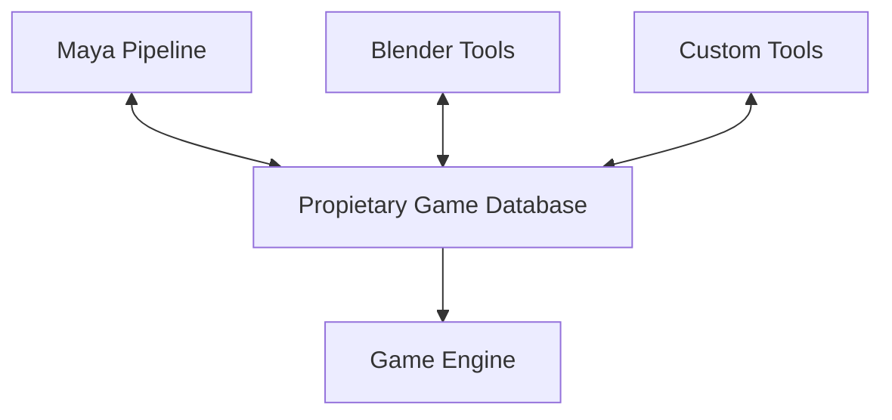
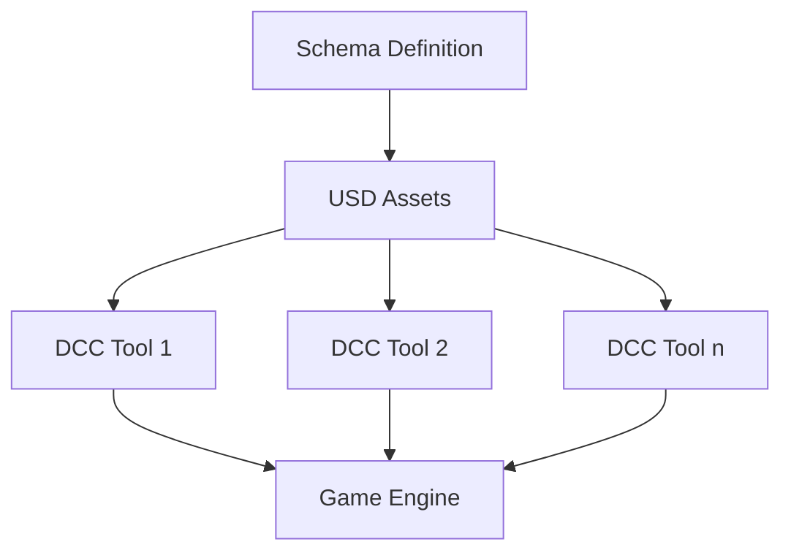

# Chapter 1: Introduction to USD Schemas for Game Development

## The Cross-DCC Challenge in Game Development

Game studios face a unique challenge: creating consistent workflows across multiple Digital Content Creation (DCC) tools on multiple operating systems, while targeting multiple runtime platforms. For most AAA studios, the workflow might involve:

- Multiple modeling tools (Maya, 3ds Max, Blender)
- Multiple animation systems (MotionBuilder, custom solutions)
- Multiple texture pipelines (Substance, Mari, Photoshop)
- Multiple effects tools (Houdini, custom particle systems)
- Multiple terrain and level design tools
- Multiple target platforms (PC, console, mobile, VR/AR)

This creates a **cross-DCC matrix problem**: where *n* tools and *m* platforms require on the order of *n*×*m* separate integration paths.

## The Traditional Game Database Approach

Traditionally, games studios solve this through proprietary game databases and conversion steps:




These databases define and correlate all sorts of engine and game play specific information:

- Health, damage, and other gameplay attributes
- Team affiliations and allegiances
- Inventory slots and capacities
- Gameplay tags and categories
- Physics properties and collision groups
- Level streaming boundaries
- LOD transition distances
- and so on.

Individual tools and pipeline step potentially have their own representations and formats, requiring frequent translation. Every conversion step introduces the possibility of dropping some unsupported data on the floor, rounding or approximation errors, and the introduction of superfluous data. All of these are difficult to detect and filter or correct, and care must be taken in all intermediate steps to minimize these faults.

Game data evolves rapidly during production, as do the requirements of description of data. Whenever some fundamental record is changed, introduced, or removed, care must be taken across all arcs in the production workflow that the new structures are integrate well and existing data is migrated properly.

## USD as a Universal Game Database

Universal Scene Description (USD) offers a potential solution to this fragmentation by providing:

1. A standardized way to define schemas
2. Strong composition capabilities
3. A growing ecosystem of integrations
4. High-performance data access patterns

However, USD was not initially designed with game-specific workflows in mind, and traditional USD schema approaches have several limitations for game development:

### Limitations of Traditional USD Schema Approaches

1. **Compilation Requirements**: Traditional USD schemas require compilation of C++ plugins for each DCC tool and engine.
2. **Deployment Complexities**: Distributing compiled plugins across a studio is challenging, especially with regular schema updates.
3. **Build Matrix Explosion**: Each (DCC tool, platform, engine version) combination requires separate plugin builds.
4. **Inflexible Updates**: Schema changes require rebuilding and redeploying across the entire ecosystem.
5. **Difficult Data Migration**: A schema change must also be accompanied by migration of existing data.

## Introducing an Alternative: Codeless Schemas

USD actually has an elegant solution for these development challenges: **Codeless Schemas**.

Codeless schemas, introduced in USD 21.08, allow schema definitions to be populated into the schema registry without requiring compilation and linking of generated C++ code. This means schemas can travel with the assets themselves, rather than requiring precompiled plugin updates at each stage of the pipeline:




## A Preview of Game-Specific Schema Requirements

Let's consider a simple game entity schema for a game called "SparkleCarrotPopper":

```usda
#usda 1.0
(
    defaultPrim = "SparkleCarrotPopper"
)

def "SparkleCarrotPopper" (
    kind = "schema"
)
{
    # Define a "Health" attribute that any game object can use
    uniform float health = 100

    # Define a "Team" attribute using tokens
    uniform token team = "neutral" (
        allowedTokens = ["neutral", "player", "enemy"]
    )

    # Define a dictionary for game metadata
    uniform dictionary metadata = {
        "spawnPoint": (vector3f) (0,0,0),
        "isBoss": (bool) false
    }
}
```

In the following chapters, we'll explore how to effectively implement such game schemas using USD's codeless schema capabilities, and how to integrate them into production pipelines with straight forward deployment strategies that rely only on existing content distribution mechanisms.

## Key Takeaways

- Game development requires consistent schemas across multiple tools and platforms
- Compiled USD schemas present deployment challenges in game contexts
- Codeless schemas provide a path to distribute schemas with assets
- A schema strategy needs to consider both authoring and runtime requirements
- Proper schema design enables powerful game-specific workflows

In the next chapter, we'll dive deeper into USD schema types, exploring the differences between IsA schemas, API schemas, and how codeless schemas fit into this ecosystem.
