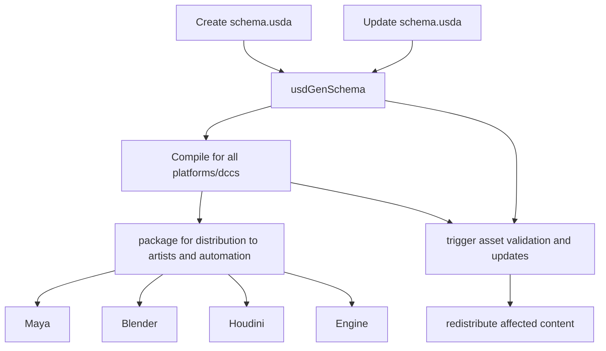
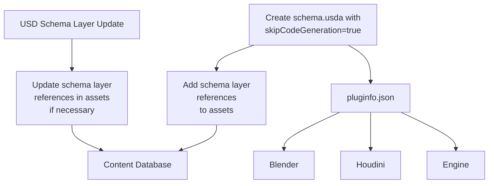

# Chapter 2: Understanding USD Schema Types

## The USD Type System: A Foundation for Game Data

Before diving into implementing game-specific schemas, it's important to understand what facilities USD's schema system provides, how it supports different data modeling approaches, and how we might apply schema design choices in game development.

## The Three Schema Categories

USD schemas fall into three main categories, each serving a different purpose in the USD ecosystem, and each with unique advantages for gamedev workflows:

1. **Typed IsA Schemas**
2. **API Schemas**
3. **Codeless Schemas**

### Typed IsA Schemas

IsA schemas define prim types within the USD type system. They are what most people initially think of when discussing "USD schemas." These schemas come in two flavors:

#### Concrete IsA Schemas

- **Definition**: Instantiable schemas that define specific types of prims
- **Examples**: `UsdGeomMesh`, `UsdLuxDiskLight`, `UsdShadeMaterial`
- **Usage**: `def Mesh "Character" {}`

Entities defined with concrete IsA schemes usually represent foundational game assets such as characters, props, environments, lights, effects, and so on.

#### Abstract IsA Schemas

- **Definition**: Cannot be instantiated directly, provide bse classes for other schemas and define common properties
- **Examples**: `UsdGeomImageable`, `UsdShadeConnectableAPI`

IsA schemas establish a strong inheritance hierarchy and typically require C++ code generation to provide an API for interacting with the schemas.

### API Schemas

API schemas enhance existing prims with additional properties without changing their underlying type, and can also provide functional interfaces for utility purposes. 

API Schemas come in three varieties:

#### Non-Applied API Schemas

- **Definition**: Provide interface to metadata or non-authoring API
- **Examples**: `UsdModelAPI`, `UsdClipsAPI`

These can be used to manage game-specific metadata, without altering asset types

#### Single-Applied API Schemas

- **Definition**: Add a fixed set of properties to a prim when applied
- **Examples**: `UsdGeomModelAPI`, `UsdGeomMotionAPI`

These can be used to add gameplay attributes to assets, such as health, inventories, etc.

#### Multiple-Applied API Schemas

- **Definition**: Can be applied multiple times with different instance names
- **Examples**: `UsdCollectionAPI`

These can be used when more than one instance of a particular schema can be applied to a single prim; for example, an entity may have multiple damage zones, a multi-slot inventory system, and so on.

API schemas are applied using the `apiSchemas` metadata field on a prim, in a manner reminiscent of components in a game engine's Entity Component system.

```usda
def Xform "Player" (
    apiSchemas = ["GameplayStatsAPI", "InventoryAPI", "EquipmentAPI"]
)
{
    # Prim contents here
}
```

### Codeless Schemas

Codeless schemas, introduced in USD 21.08, represent a game-changer for cross-DCC pipelines:

- **Definition**: Schema definitions that populate into the USD schema registry without requiring compilation of C++ code
- **Characteristic**: Maintain the same semantic meaning as traditional schemas, but with different deployment mechanics
- **Query Mechanism**: Standard `UsdPrim` and `UsdAttribute` methods (no specialized C++ API)
- **Game Context**: Perfect for rapidly evolving game schemas that need to be distributed across studios

### Real-World Usage of Codeless Schemas

Many studios using USD for games have adopted codeless schemas. Some quotes:

"We publish codeless schemas for just about every concept in RenderMan, making use of autoApply schemas heavily to (e.g.) extend UsdLux light types and UsdRender types when you're in a RenderMan/hdPrman environment."

"We use codeless schemas for defining new prim types for things like procedurals and simulations. We have a node in Nuke that will generate a UI from a schema so this gives an easy way to extend the system for us."

Game studios can apply the same pattern to gameplay concepts:

- Define game-specific entity types (enemies, pickups, spawners) as codeless schemas
- Define gameplay attributes (health, damage, team affiliations) as codeless API schemas
- Apply these schemas to standard geometric assets

### Implementation Example

Creating a codeless schema is similar to creating any schema; the thing that makes them codeless is the skipCodeGeneration flag. Note that even though a codeless schema does not require associated code generation it still requires a genUsdSchema step. When this flag is set, USD's schema generation only creates:

- The schema registry entries (.usda files)
- Plugin metadata (in plugInfo.json)

The C++ and Python code generation is skipped entirely, meaning these schemas have no compiled language bindings but still exist in the USD type system at runtime. We'll come back to the implications on distribution shortly.

```usda
#usda 1.0
(
    subLayers = [
        @usd/schema.usda@,
        @usdGeom/schema.usda@
    ]
)

over "GLOBAL" (
    customData = {
        string libraryName   = "gamePlaySchemas"
        string libraryPath   = "./"
        string libraryPrefix = "GamePlay"
        
        # This is the flag that makes the schema codeless:
        bool skipCodeGeneration = true
    }
) {
}

# Example of a codeless API schema
class "GameStatsAPI" (
    inherits = </APISchemaBase>
    customData = {
        token apiSchemaType = "singleApply"
    }
    doc = """Defines gameplay statistics that can be applied to any entity."""
)
{
    # Note the namespace to avoid conflicts
    uniform float gameplay:stats:health = 100 (
        doc = "Current health of the entity"
    )
    
    uniform float gameplay:stats:maxHealth = 100 (
        doc = "Maximum health of the entity"
    )
    
    uniform token gameplay:stats:team = "neutral" (
        allowedTokens = ["neutral", "player", "enemy"]
        doc = "Team affiliation of the entity"
    )
}
```

### Code Access Patterns

A key difference between compiled and codeless schemas is how you access their data in code:

#### Compiled Schema Access

```cpp
// C++ with compiled schemas
UsdPrim prim = stage->GetPrimAtPath("/Game/Player");
GameStatsAPI stats(prim);
if (stats) {
    float health = stats.GetHealthAttr().Get();
    GfVec3f position = stats.GetSpawnPointAttr().Get();
}
```

#### Codeless Schema Access

```cpp
// C++ with codeless schemas
UsdPrim prim = stage->GetPrimAtPath("/Game/Player");
if (prim.HasAPI<TfType::Find<class GameStatsAPI>>()) {
    UsdAttribute healthAttr = prim.GetAttribute("gameplay:stats:health");
    float health;
    healthAttr.Get(&health);
    
    UsdAttribute spawnPointAttr = prim.GetAttribute("gameplay:stats:spawnPoint");
    GfVec3f position;
    spawnPointAttr.Get(&position);
}
```

While codeless schemas require slightly more verbose access code, they provide tremendous flexibility in deployment and iteration.


## Codeless Schemas in Game Development

### Deployment Flexibility

Traditional IsA and API schemas require compiled C++ plugins to be deployed to every DCC tool and build target. For a studio with multiple tools and platforms, this creates an exponential deployment matrix.

Codeless schemas, by contrast, travel with the USD assets themselves:

#### Plugin based Schema Deployment:


#### Codeless Schema Deployment:



### Developer Workflow Integration

Codeless schemas fit naturally into modern game development workflows:

- Can be version-controlled alongside game asset data
- Can be updated without recompiling tools
- Can be distributed to artists via standard content distribution mechanisms
- Can evolve during production without greatly reduced engineering overhead

### 4. When to Use Each Schema Type in Games

Let's start by looking at a concrete example.

```usda
#usda 1.0
(
    subLayers = [
        @sparkleGame/schema.usda@
    ]
)

def "Level" (
    kind = "component"
)
{
    # Use our game-specific entity type
    def SparkleCarrotEnemy "Boss" (
        # Also apply our damage API schema
        apiSchemas = ["SparkleDamageAPI", "SparkleLootAPI:commonDrop", "SparkleLootAPI:rareDrop"]
    )
    {
        float sparkle:health = 500
        token sparkle:difficulty = "boss"
        float3 sparkle:patrolRadius = (10, 0, 10)
        
        # Properties from damage API schema
        float sparkle:damage:resistance = 0.25
        token[] sparkle:damage:vulnerabilities = ["fire", "crushing"]
        
        # Properties from first loot API instance
        string sparkle:loot:commonDrop:itemId = "carrot_piece"
        float sparkle:loot:commonDrop:dropChance = 1.0
        int sparkle:loot:commonDrop:minQuantity = 5
        int sparkle:loot:commonDrop:maxQuantity = 10
        
        # Properties from second loot API instance
        string sparkle:loot:rareDrop:itemId = "golden_carrot"
        float sparkle:loot:rareDrop:dropChance = 0.1
        int sparkle:loot:rareDrop:minQuantity = 1
        int sparkle:loot:rareDrop:maxQuantity = 1
    }
}
```

This example demonstrates the flexibility and expressiveness of codeless schemas for game development, showing how gameplay concepts can travel with the assets.

### When to use a particular Schema type

The decision of which schema type to use depends on your specific game development needs:

| Schema Type | When to Use | Example Game Use Case |
|-------------|-------------|-----------------------|
| IsA (Compiled) | Core asset types that need optimized C++ access | Character rigs, terrain systems |
| API (Compiled) | Extensions to assets requiring API-level integration | Physics behaviors, animation systems | 
| Codeless IsA | Game-specific entity types | NPCs, interactive objects, spawners |
| Codeless API | Game-specific attributes | Health, inventory, game state flags |

## Decision Framework for Game Developers

To determine which schema approach is appropriate for your game project, consider the following questions:

1. **Team Structure**
   - Do you have dedicated USD plugin developers?
   - How many technical artists vs. engineers are on your team?

2. **Deployment Constraints**
   - How many DCC tools are in your pipeline?
   - How many target platforms do you ship to?

3. **Update Frequency**
   - How often will your schemas need to change during production?
   - What's your workflow for schema versioning?

4. **Performance Requirements**
   - Do you need high-performance access from C++ code?
   - Are you working with massive scene graphs where schema resolution could be a bottleneck?

5. **Integration Requirements**
   - Do you need deep integration with proprietary engine systems?
   - Are your schemas exposing functionality beyond data modeling?


## Key Takeaways

- USD provides multiple schema types suited for different aspects of game development
- Codeless schemas eliminate the compilation and deployment barriers for cross-DCC workflows
- API schemas allow extending existing assets with game-specific properties
- Schema choice should consider team structure, deployment constraints, and performance needs
- Proper namespace conventions help avoid conflicts in complex game scenes
- Real-world studios are successfully using codeless schemas for production workflows

In the next chapter, we'll explore combining USD's composition strategies with schema-driven game systems.
